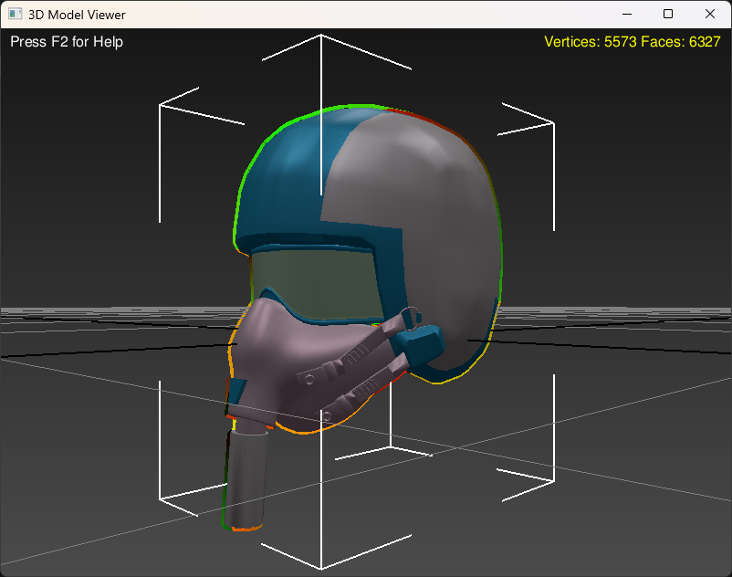

# IGI2 Covert Strike MEF File 3D Viewer



**IGI2 Covert Strike MEF File 3D Viewer** is a powerful and user-friendly application designed to visualize 3D models from MEF (Model Exchange Format) files used in *Project IGI 2: Covert Strike*. Whether you're a game developer, modder, or 3D enthusiast, this tool provides an intuitive interface to explore and interact with complex 3D models extracted from the game.

## Table of Contents

- [Features](#features)
- [Dependencies](#dependencies)
- [Installation](#installation)
- [Building with MinGW](#building-with-mingw)
- [Usage](#usage)
- [Contributing](#contributing)
- [License](#license)
- [Contact](#contact)

## Features

- **3D Model Visualization:** Load and view 3D models from IGI2 MEF files with high fidelity.
- **Interactive Controls:** Orbit, pan, and zoom the camera to explore models from any angle.
- **Mesh Selection:** Select individual meshes to inspect details or apply transformations.
- **Material Handling:** Display materials with accurate colors and textures.
- **Bone Hierarchy Visualization:** Visualize bone structures and hierarchies for animated models.
- **Export Functionality:** Export loaded models to common formats like OBJ for use in other 3D applications.

## Dependencies

To build and run the IGI2 Covert Strike MEF File 3D Viewer, ensure the following dependencies are installed:

### Core Dependencies

- **[FLTK (Fast Light Toolkit)](https://www.fltk.org/):** A cross-platform C++ GUI toolkit for handling windowing and user interface elements.
- **[GLM (OpenGL Mathematics)](https://glm.g-truc.net/0.9.9/index.html):** A header-only C++ mathematics library for graphics software based on the OpenGL Shading Language (GLSL) specifications.
- **[OpenGL](https://www.opengl.org/):** A cross-language, cross-platform API for rendering 2D and 3D vector graphics.
- **[MinGW (Minimalist GNU for Windows)](http://www.mingw.org/):** A minimalist development environment for native Microsoft Windows applications.

### Additional Dependencies

- **Standard C++ Libraries:** Included with your compiler.
- **[Windows API](https://docs.microsoft.com/en-us/windows/win32/apiindex/windows-api-list):** For file handling and system interactions.

## Installation

### 1. Install MinGW

Download and install MinGW from the [official website](http://www.mingw.org/). During installation, ensure you include the following packages:

- `mingw32-gcc-g++`: The GNU C++ compiler.
- `mingw32-fltk`: FLTK libraries.

Alternatively, you can use [MSYS2](https://www.msys2.org/) for an updated MinGW environment with easier package management.

### 2. Install FLTK

If not included with MinGW, download and install FLTK:

1. Download FLTK from the [official website](https://www.fltk.org/software.php).
2. Follow the [FLTK installation guide](https://www.fltk.org/doc-1.3/compile.html) for building from source or using precompiled binaries.

### 3. Install GLM

Since GLM is a header-only library, you can install it easily:

1. Download GLM from the [official repository](https://github.com/g-truc/glm).
2. Extract the contents and place the `glm` folder in your include directories, e.g., `C:\mingw\include\`.

## Building with MinGW

Follow these steps to build the IGI2 Covert Strike MEF File 3D Viewer using MinGW:

### 1. Clone the Repository

```bash
git clone https://github.com/yourusername/IGI2-Covert-Strike-MEF-Viewer.git
cd IGI2-Covert-Strike-MEF-Viewer
```

### 2. Set Up the Build Environment

Ensure that the MinGW `bin` directory is in your system's `PATH`. For example:

```bash
set PATH=C:\MinGW\bin;%PATH%
```

### 3. Compile the Application

Use `g++` to compile the `main.cpp` along with other necessary source files. Here's an example command:

```bash
g++ -std=c++17 -o IGI2_MEF_Viewer main.cpp viewport3d.cpp other_sources.cpp -lfltk -lGL -lGLU -lglut
```

**Explanation of Flags:**

- `-std=c++17`: Use the C++17 standard.
- `-o IGI2_MEF_Viewer`: Output executable named `IGI2_MEF_Viewer`.
- `main.cpp viewport3d.cpp other_sources.cpp`: Source files to compile.
- `-lfltk`: Link against FLTK library.
- `-lGL -lGLU -lglut`: Link against OpenGL libraries.

**Note:** Replace `other_sources.cpp` with actual source files required by your project.

### 4. Resolve Library Paths (If Necessary)

If FLTK or OpenGL libraries are not in standard locations, specify their paths using `-I` for include directories and `-L` for library directories. For example:

```bash
g++ -std=c++17 -I"C:\path\to\fltk\include" -I"C:\path\to\glm" -L"C:\path\to\fltk\lib" -o IGI2_MEF_Viewer main.cpp viewport3d.cpp other_sources.cpp -lfltk -lopengl32 -lglu32 -lglut32
```

### 5. Run the Application

After successful compilation, run the application from the command line:

```bash
IGI2_MEF_Viewer.exe path_to_mef_file.mef
```

## Usage

Launch the viewer with an MEF file as a command-line argument:

```bash
IGI2_MEF_Viewer.exe <input_mesh_file.mef>
```

### Controls

- **Orbit:** Hold `ALT` + Middle Mouse Button and drag to rotate the camera around the model.
- **Pan:** Click and drag the Middle Mouse Button to move the camera horizontally or vertically.
- **Zoom:** Use the Mouse Wheel to zoom in and out.
- **Select Object:** Left-click to select individual meshes.
- **Multi-Select:** Hold `CTRL` and left-click to select multiple meshes.
- **Toggle Options:**
  - `F2`: Show/Hide legend.
  - `B`: Toggle gradient background.
  - `G`: Toggle grid display.
  - `U`: Switch between orthographic and perspective projection.
  - `W`, `E`, `R`: Switch between move, rotate, and scale tools.
  - `Escape`: Exit the application.

### Exporting Models

You can export the loaded MEF model to an OBJ file for use in other 3D applications:

1. Select the desired model in the viewer.
2. Use the export functionality from the menu or command-line (implementation dependent).

## Contributing

Contributions are welcome! Whether it's reporting bugs, suggesting features, or submitting pull requests, your input is valuable.

### Steps to Contribute

1. **Fork the Repository:** Click the "Fork" button at the top-right corner of the repository page.
2. **Clone Your Fork:**

   ```bash
   git clone https://github.com/yourusername/IGI2-Covert-Strike-MEF-Viewer.git
   cd IGI2-Covert-Strike-MEF-Viewer
   ```

3. **Create a Branch:**

   ```bash
   git checkout -b feature/YourFeatureName
   ```

4. **Commit Your Changes:**

   ```bash
   git commit -m "Add feature XYZ"
   ```

5. **Push to Your Fork:**

   ```bash
   git push origin feature/YourFeatureName
   ```

6. **Open a Pull Request:** Navigate to the original repository and open a pull request from your fork.

### Coding Standards

- Follow consistent naming conventions.
- Write clear and concise code comments.
- Ensure code is well-formatted and follows best practices.

### Issue Reporting

If you encounter any issues, please open an [issue](https://github.com/yourusername/IGI2-Covert-Strike-MEF-Viewer/issues) with detailed information.

## License

This project is licensed under the [MIT License](LICENSE).

## Contact

For any questions or suggestions, feel free to reach out:

- **Email:** your.email@example.com
- **GitHub:** [yourusername](https://github.com/yourusername)

---

*Developed with ❤️ for the Project IGI 2 community.*
